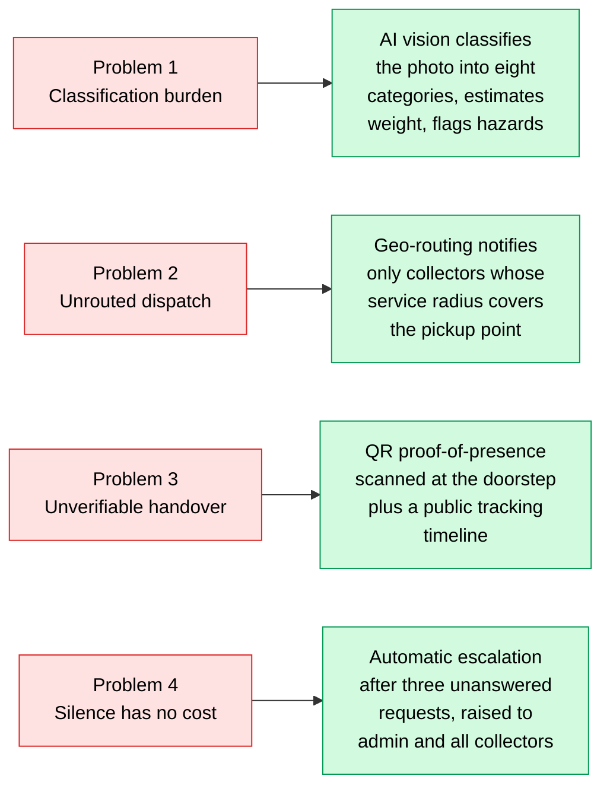
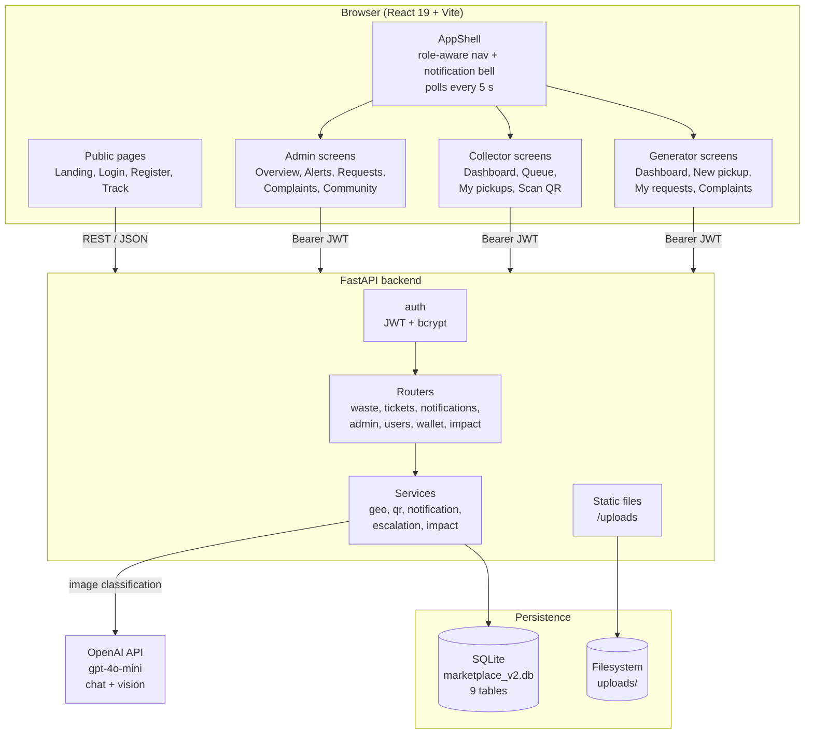
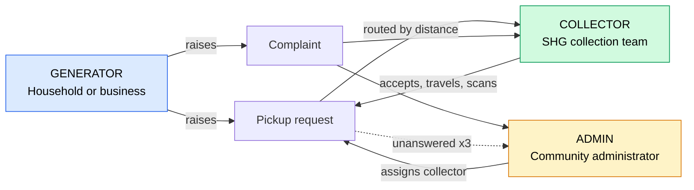
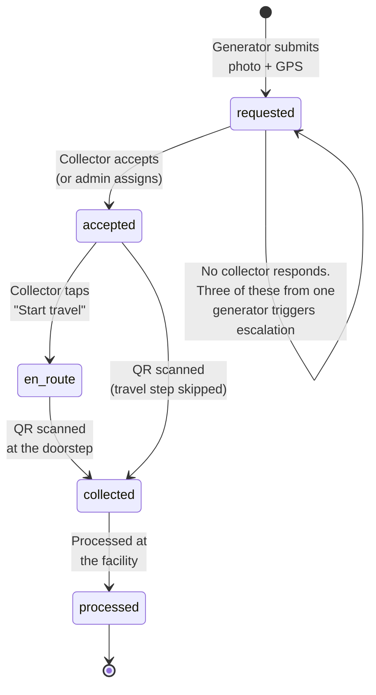
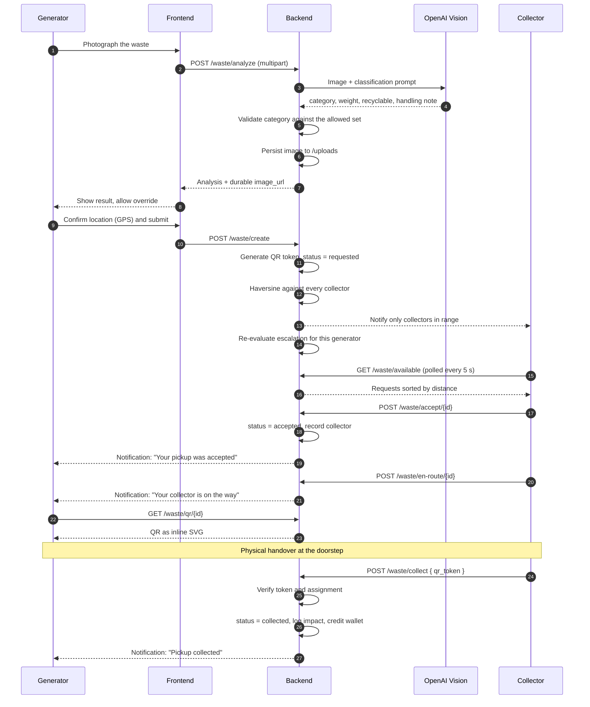
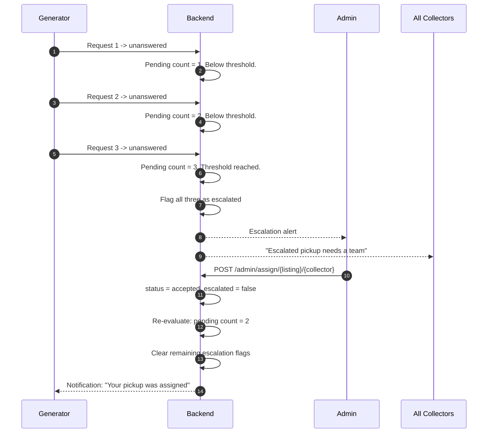
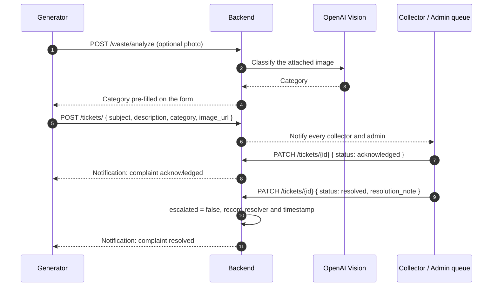
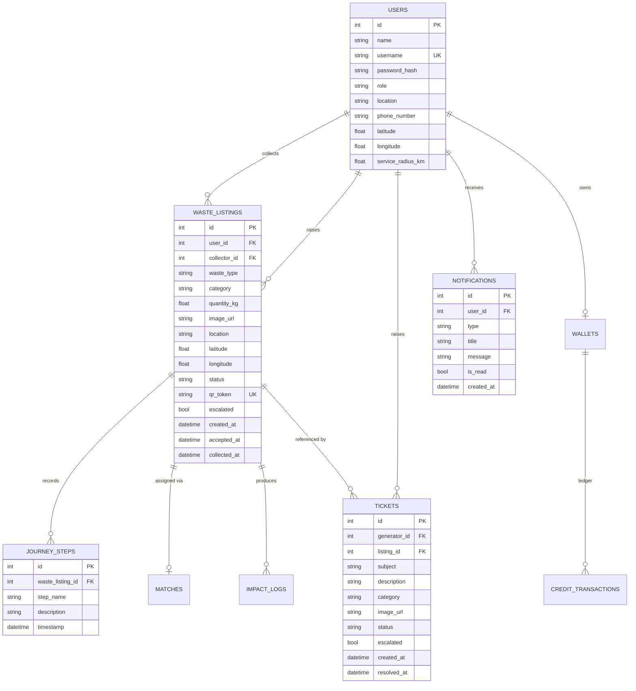

# SafaiSetu

**A bridge between the doorstep that produces waste and the team that collects it.**

SafaiSetu is a community waste-management platform that connects households and small
businesses with local Self-Help Group (SHG) collection teams. A generator photographs their
waste, an AI vision model classifies and weighs it, the request is routed to collection teams
whose service radius actually covers that address, and the handover is verified by a QR scan
at the doorstep. A community administrator oversees the whole loop and is alerted automatically
when requests go unanswered.

---

## Table of Contents

| Section | Description |
| --- | --- |
| [The Problem](#the-problem) | What is broken in community waste collection today |
| [Target Audience](#target-audience) | Who this is built for |
| [Solution Overview](#solution-overview) | How SafaiSetu addresses each problem |
| [Feature Matrix](#feature-matrix) | Capabilities by role |
| [System Architecture](#system-architecture) | Components and how they connect |
| [Roles and Permissions](#roles-and-permissions) | Access control matrix |
| [Pickup Lifecycle](#pickup-lifecycle) | The state machine every request follows |
| [Core Workflows](#core-workflows) | Sequence diagrams for the main journeys |
| [Design Decisions](#design-decisions) | Why the mechanisms work the way they do |
| [Data Model](#data-model) | Entity relationships and tables |
| [API Reference](#api-reference) | All 38 endpoints |
| [Project Structure](#project-structure) | Directory layout |
| [Technology Stack](#technology-stack) | Languages, frameworks, versions |
| [Getting Started](#getting-started) | Installation and first run |
| [Configuration](#configuration) | Environment variables |
| [Demo Accounts](#demo-accounts) | Pre-seeded logins for evaluation |
| [Testing](#testing) | Test suites and how to run them |
| [Security Notes](#security-notes) | Current posture and known gaps |
| [Known Limitations](#known-limitations) | Honest list of what is not done |
| [Roadmap](#roadmap) | Planned work |

---

## The Problem

Municipal and community waste collection in dense Indian neighbourhoods fails at four specific
points. SafaiSetu targets each one directly.

```
PROBLEM                                  CONSEQUENCE
-----------------------------------------------------------------------------------
1. Households cannot classify waste      Mixed waste reaches the facility, recyclable
   correctly                             value is lost, organic streams are contaminated

2. No structured channel between a       Collection runs on informal phone calls and
   household and a collection team       fixed routes; ad-hoc requests are missed

3. No proof that collection actually     Disputes over whether a pickup happened; no
   happened                              auditable record for the ward office

4. Complaints disappear into a void      A household ignored three times has no path
                                         to escalate; the administrator never finds out
```

### Problem 1: Classification is a burden placed on the wrong person

Segregation rules are non-obvious. Asking every household to correctly identify plastic
versus e-waste versus hazardous waste produces inconsistent input, which degrades everything
downstream. The classification burden belongs on the system, not the citizen.

### Problem 2: Dispatch is informal and unrouted

Collection teams work fixed routes. A household with an unusual or urgent pickup has no way to
signal it, and a collection team has no way to discover demand near them. Requests and capacity
exist simultaneously without ever meeting.

### Problem 3: Handover is unverifiable

When a household says a pickup was missed and a collector says it was completed, there is no
record. Without proof of collection there is no accountability, no reliable tonnage data, and
no basis for paying SHG teams accurately.

### Problem 4: Silence has no consequence

The most damaging failure is the quiet one. A household whose requests are never accepted has
no escalation path. The administrator only learns about it when the complaint reaches them by
some other route, if it ever does.

---

## Target Audience

### Primary users

| Audience | Profile | What they need |
| --- | --- | --- |
| **Waste Generators** | Households, hostels, shops, small restaurants in urban and peri-urban wards | A way to hand over waste without phone calls, and confidence that it was collected |
| **Collection Teams (SHG)** | Self-Help Group collectors, typically women's cooperatives, working a neighbourhood route | Visibility of nearby demand, one-tap acceptance, and a paperwork-free way to close a job |
| **Community Administrators** | Ward officers, Resident Welfare Association secretaries, municipal supervisors | Oversight of the whole loop, and early warning when service is failing |

### Secondary beneficiaries

| Audience | Benefit |
| --- | --- |
| Municipal bodies | Auditable tonnage and diversion data per ward |
| Recycling and composting facilities | Cleaner, pre-classified input streams |
| NGOs and CSR programmes | Verifiable impact metrics tied to individual collection events |
| SHG federations | Evidence of work performed, supporting fair payment |

### Deployment context

SafaiSetu is designed for a single ward, society, or campus operated by one administrator, with
tens of collection teams and thousands of generators. It is not designed as a city-wide
multi-tenant system in its current form. See [Known Limitations](#known-limitations).

---

## Solution Overview



---

## Feature Matrix

| Capability | Generator | Collector | Admin |
| --- | :---: | :---: | :---: |
| Photograph waste and receive AI classification | Yes | - | - |
| Raise a pickup request with GPS coordinates | Yes | - | - |
| Receive distance-sorted nearby requests | - | Yes | - |
| Accept a request | - | Yes | Yes (override) |
| Mark en route | - | Yes | - |
| Display handover QR code | Yes | - | View only |
| Scan QR to complete collection | - | Yes | - |
| Manually confirm pickup (fallback) | Yes | - | - |
| Public tracking by code (no login) | Anyone | Anyone | Anyone |
| Raise a complaint with photo | Yes | - | - |
| Work the complaint queue | - | Yes | Yes |
| See escalation alerts | - | Yes | Yes |
| Assign a collector by hand | - | - | Yes |
| Community-wide statistics | - | Partial | Yes |
| Green credits wallet | Yes | - | - |

---

## System Architecture



### Architectural principles

| Principle | Implementation |
| --- | --- |
| **Single source of truth for status** | The status vocabulary lives in `backend/models.py` and is mirrored once in the frontend design system. Nothing else redefines it. |
| **Polling over WebSockets** | Deliberate. Polling survives server restarts, needs no reconnection logic, and demonstrates reliably. See [Design Decisions](#design-decisions). |
| **Failures are surfaced, never hidden** | No API wrapper resolves an error into placeholder data. A backend outage renders an error with a retry action, not a convincing zero. |
| **Server-side image persistence** | Uploads are stored by the backend and served from `/uploads`. Browser `blob:` URLs are never persisted, because they resolve only in the tab that created them. |
| **Path-independent configuration** | The database path and `.env` location are anchored to the project root, so the server behaves identically regardless of the working directory it is launched from. |

---

## Roles and Permissions

Three roles are defined in `backend/models.py` and enforced by FastAPI dependencies in
`backend/auth.py`. Every cross-role attempt returns HTTP 403.



### Permission enforcement

| Dependency | Allows | Used by |
| --- | --- | --- |
| `get_current_user` | Any authenticated user | Profile, notifications, QR retrieval |
| `get_current_generator` | Generator only | Create request, confirm pickup, raise ticket |
| `get_current_collector` | Collector only | Nearby queue, accept, en route, QR scan |
| `get_current_admin` | Admin only | Overview, assign collector, user list |
| `get_current_collector_or_admin` | Collector or Admin | Complaint queue, escalation alerts |

---

## Pickup Lifecycle

Every request moves through exactly five states. Transitions are enforced server-side; an
out-of-order transition returns HTTP 400.



| State | Meaning | Who can advance it |
| --- | --- | --- |
| `requested` | Waiting for a collection team | Collector (accept), Admin (assign) |
| `accepted` | A specific team has claimed it | The assigned collector only |
| `en_route` | The team is travelling to the address | The assigned collector only |
| `collected` | QR verified at handover; credits awarded | System |
| `processed` | Processed at the facility | System |

---

## Core Workflows

### Workflow 1: Request to verified collection



### Workflow 2: Escalation when nobody responds

The rule is precise: when a single generator accumulates **three requests still in `requested`
state**, every one of those requests is flagged and both the administrator and all collectors
are alerted.



**Idempotency.** Alerts fire only on the transition *into* escalation. A client polling every
five seconds cannot flood the administrator with duplicates, and clearing the backlog removes
the flags automatically.

### Workflow 3: Complaint handling



---

## Design Decisions

### The QR code is proof of presence, not a label

This is the mechanism the entire accountability model rests on.

```
   GENERATOR'S SCREEN                        COLLECTOR'S DEVICE
   +---------------------+                   +---------------------+
   |   [ QR CODE ]       |                   |   Camera scanner    |
   |   token: Raa_btc... |  ---- scan ---->  |   or manual entry   |
   +---------------------+                   +---------------------+
             |                                          |
             |  GET /waste/qr/{id}                      |  POST /waste/collect
             |  Owner or admin ONLY.                    |  Verifies the token and
             |  A collector requesting                  |  that the pickup is
             |  this receives HTTP 403.                 |  assigned to this collector.
             v                                          v
   The token exists in exactly one place a collector cannot reach
   without being physically in front of the generator.
```

If a collector could read the token for their own assigned pickup, they could mark it collected
from anywhere and the record would be worthless. The 403 is therefore not incidental
housekeeping; it is the property that makes a scan mean something. It is covered by an
automated test.

The same token backs the public tracking page, so a generator can follow a pickup without
logging in. The token is unguessable (`secrets.token_urlsafe(16)`) and the tracking view is
strictly read-only.

### Geographic routing uses real distance

Collector service areas are circles: a centre point (`latitude`, `longitude`) and a
`service_radius_km`. Distance is computed with the haversine formula on a 6371 km earth radius.

```
                  service_radius_km = 8 km
              . - - - - - - - - - - - - - .
           .                                 .
         .          [C] Collector              .
        .                 \                     .
        .                  \  2.14 km            .
        .                   \                    .
         .                  [G] Generator       .
           .                                 .
              ` - - - - - - - - - - - - - `

    Inside the radius  -> notified, appears in queue with distance
    Outside the radius -> not notified, request not visible
    No coordinates set -> included anyway, distance shown as unknown
```

**Collectors without coordinates are deliberately included.** Excluding them would silently
drop requests, which is a worse failure than notifying one team too many.

### Polling rather than WebSockets

| Consideration | Polling (chosen) | WebSockets |
| --- | --- | --- |
| Survives backend restart | Yes, automatically | Requires reconnection logic |
| Behaviour under `--reload` | Unaffected | Connection drops on every code change |
| Additional dependencies | None | Connection manager, heartbeat, backoff |
| Perceived latency | Up to 5 seconds | Near-instant |
| Failure mode | One missed request, retried | Silent disconnection |

For pickup dispatch, a five-second delay is immaterial, and the reliability is worth more than
the latency. The unread-count endpoint (`/notifications/count`) is intentionally minimal so the
poll stays cheap.

### Fallbacks never masquerade as real data

The image analysis endpoint returns canned data when the AI call fails, so a demo continues to
work offline. That fallback is explicitly tagged `[MOCK]` in the description field, and the test
suite **fails** if a live analysis returns mock data. A fallback that cannot be distinguished
from a real result is worse than an error, because it hides the outage.

The same principle governs the frontend API layer: no method converts a rejection into
placeholder zeros. An outage renders an error banner with a retry action.

---

## Data Model



### Tables

| Table | Purpose | Key columns |
| --- | --- | --- |
| `users` | All three roles in one table, discriminated by `role` | `role`, `latitude`, `longitude`, `service_radius_km` |
| `waste_listings` | Pickup requests and their full lifecycle | `status`, `qr_token`, `escalated`, `collector_id` |
| `tickets` | Complaints, optionally tied to a request | `status`, `escalated`, `resolution_note` |
| `notifications` | Per-user inbox, read by polling | `type`, `is_read` |
| `journey_steps` | Append-only audit trail per request | `step_name`, `timestamp` |
| `matches` | Assignment record with a match score | `cooperative_id`, `match_score` |
| `impact_logs` | CO2 and income recorded per collection | `co2_saved`, `income_generated` |
| `wallets` | Green credit balance per generator | `balance`, `badges` |
| `credit_transactions` | Wallet ledger | `amount`, `transaction_type` |

### Waste categories

The vision model must return exactly one of these. Any value outside the set is coerced to
`mixed`, so a hallucinated label can never reach the routing logic.

| Category | Description |
| --- | --- |
| `plastic` | Bottles, packaging, containers |
| `organic` | Food scraps, vegetable peels, garden waste |
| `paper` | Cardboard, newspaper, office paper |
| `metal` | Cans, scrap metal |
| `glass` | Bottles, jars |
| `ewaste` | Electronics, cables, appliances |
| `hazardous` | Medical, chemical, battery waste |
| `mixed` | Unsegregated or unidentifiable |

### Impact formulas

Defined in `backend/services/impact_service.py`. These are transparent MVP approximations, not
calibrated life-cycle figures.

| Metric | Formula |
| --- | --- |
| CO2 saved | `quantity_kg * 0.5` kg CO2e |
| Income generated | `quantity_kg * 4.0` INR |
| Green credits | `quantity_kg * 10` points |

---

## API Reference

Base URL: `http://127.0.0.1:8000`. Interactive documentation at `/docs`.
All authenticated endpoints expect `Authorization: Bearer <jwt>`.

### Authentication

| Method | Endpoint | Access | Description |
| --- | --- | --- | --- |
| POST | `/signup` | Public | Register. Validates role, captures coordinates. Returns a JWT. |
| POST | `/login` | Public | OAuth2 password form. Returns a JWT. |
| GET | `/users/me` | Authenticated | Current user profile |
| GET | `/users/` | Authenticated | List users |

### Waste requests

| Method | Endpoint | Access | Description |
| --- | --- | --- | --- |
| POST | `/waste/analyze` | Generator | Upload an image. Returns classification, weight estimate, and a durable `image_url`. |
| POST | `/waste/create` | Generator | Create a request. Mints the QR token and notifies nearby collectors. |
| GET | `/waste/my` | Authenticated | The caller's own requests |
| GET | `/waste/available` | Collector | Open requests inside the caller's radius, nearest first |
| POST | `/waste/accept/{listing_id}` | Collector | Claim a request |
| POST | `/waste/en-route/{listing_id}` | Assigned collector | Mark travel started |
| POST | `/waste/collect` | Assigned collector | Complete via QR token. Awards credits. |
| POST | `/waste/confirm-pickup/{listing_id}` | Owning generator | Manual completion fallback |
| GET | `/waste/pickups` | Collector | Everything this collector has accepted |
| GET | `/waste/qr/{listing_id}` | Owner or Admin | Handover QR as inline SVG |
| GET | `/waste/track/{qr_token}` | **Public** | Full chain of custody, no login required |

### Notifications

| Method | Endpoint | Access | Description |
| --- | --- | --- | --- |
| GET | `/notifications/` | Authenticated | Newest first |
| GET | `/notifications/count` | Authenticated | Unread count only. Cheap; polled every 5 s. |
| POST | `/notifications/read` | Authenticated | Mark specific notifications, or all, as read |

### Complaints

| Method | Endpoint | Access | Description |
| --- | --- | --- | --- |
| POST | `/tickets/` | Generator | Raise a complaint. Notifies all collectors and admins. |
| GET | `/tickets/my` | Generator | The caller's own complaints |
| GET | `/tickets/` | Collector or Admin | Work queue, escalated first |
| PATCH | `/tickets/{ticket_id}` | Collector or Admin | Acknowledge or resolve |

### Administration

| Method | Endpoint | Access | Description |
| --- | --- | --- | --- |
| GET | `/admin/overview` | Admin | Community-wide counters |
| GET | `/admin/alerts` | Collector or Admin | Escalated, still-unanswered requests |
| GET | `/admin/requests` | Admin | All requests, filterable by status |
| GET | `/admin/users` | Admin | All users, filterable by role |
| POST | `/admin/assign/{listing_id}/{collector_id}` | Admin | Assign a team by hand |
| POST | `/admin/recheck-escalations` | Admin | Re-evaluate every generator's backlog |

### Impact and wallet

| Method | Endpoint | Access | Description |
| --- | --- | --- | --- |
| GET | `/impact/my` | Authenticated | Personal totals |
| GET | `/impact/summary` | Public | Community totals |
| GET | `/impact/partner-stats` | Collector | Team throughput and earnings |
| GET | `/impact/history` | Authenticated | Revenue history |
| GET | `/wallet/balance` | Authenticated | Green credit balance and badges |
| POST | `/wallet/redeem` | Authenticated | Spend credits. Takes query parameters, not a body. |

### AI assistant

| Method | Endpoint | Access | Description |
| --- | --- | --- | --- |
| POST | `/chatbot/start` | Authenticated | Begin an assistant session |
| POST | `/chatbot/answer` | Authenticated | Send a message. Replies in the user's language. |
| POST | `/chatbot/complete` | Authenticated | End the session |

> **Note.** The chatbot endpoints are fully functional but are not currently linked from the
> redesigned navigation. See [Known Limitations](#known-limitations).

---

## Project Structure

```
project/
|
+-- backend/
|   +-- main.py                       FastAPI app, CORS, router registration, /uploads mount
|   +-- models.py                     SQLAlchemy models; role and status vocabulary
|   +-- schemas.py                    Pydantic request and response schemas
|   +-- database.py                   Engine and session; DB path anchored to project root
|   +-- auth.py                       JWT issuing, bcrypt hashing, role dependencies
|   +-- seed_data.py                  Initial demo dataset
|   |
|   +-- routers/
|   |   +-- auth.py                   /signup, /login
|   |   +-- users.py                  /users
|   |   +-- waste.py                  Analysis, requests, accept, en route, QR, tracking
|   |   +-- notifications.py          Inbox and unread count
|   |   +-- tickets.py                Complaint lifecycle
|   |   +-- admin.py                  Overview, alerts, assignment
|   |   +-- impact.py                 Impact statistics
|   |   +-- wallet.py                 Green credits
|   |   +-- matching.py               Match recommendations
|   |   +-- debug.py                  NOT REGISTERED. See Security Notes.
|   |
|   +-- services/
|   |   +-- geo_service.py            Haversine distance and radius matching
|   |   +-- qr_service.py             Token generation and SVG rendering
|   |   +-- notification_service.py   Creation and fan-out
|   |   +-- escalation_service.py     The three-unanswered-requests rule
|   |   +-- impact_service.py         CO2, income, and credit awards
|   |   +-- matching_service.py       Match scoring
|   |   +-- prediction_service.py     Placeholder for future ML
|   |
|   +-- chatbot/
|       +-- ai_client.py              OpenAI client: chat and vision classification
|       +-- service.py                Conversation state and DB search
|       +-- router.py                 Chatbot endpoints
|
+-- fronted/
|   +-- src/
|       +-- App.jsx                   Router; resolves screens by role
|       +-- api.js                    Single API client; surfaces backend error messages
|       +-- index.css                 Design tokens: brand and ink palettes, status colours
|       |
|       +-- components/
|       |   +-- ui.jsx                Design system primitives
|       |   +-- AppShell.jsx          Role-aware navigation and notification bell
|       |
|       +-- pages/
|           +-- Landing.jsx           Public landing page
|           +-- Auth.jsx              Login and registration with GPS capture
|           +-- Track.jsx             Public tracking timeline
|           +-- generator/            Dashboard, NewRequest, MyRequests, Complaints
|           +-- collector/            Dashboard, Queue, MyPickups, Scan
|           +-- admin/                Dashboard, Alerts, Requests, Users, Complaints
|
+-- tests/                            Verification scripts, run against a live server
+-- uploads/                          Persisted waste images (gitignored)
+-- requirements.txt                  Python dependencies
+-- create_demo_users.py              Idempotent demo account creation
+-- migrate_passwords.py              One-off: plaintext to bcrypt
+-- migrate_v3.py                     One-off: two-role to three-role model
```

---

## Technology Stack

### Backend

| Component | Technology | Version |
| --- | --- | --- |
| Language | Python | 3.14.4 |
| Web framework | FastAPI | 0.139.2 |
| ASGI server | Uvicorn | latest |
| ORM | SQLAlchemy | 2.0.51 |
| Validation | Pydantic | 2.13.4 |
| Database | SQLite | bundled |
| AI | OpenAI Python SDK (`gpt-4o-mini`) | 2.46.0 |
| Password hashing | bcrypt (called directly) | 5.0.0 |
| Tokens | python-jose | latest |
| QR generation | qrcode | latest |

### Frontend

| Component | Technology | Version |
| --- | --- | --- |
| Framework | React | 19.2 |
| Build tool | Vite | 7.2 |
| Styling | Tailwind CSS | 4.1 |
| Routing | React Router | 7.12 |
| Icons | lucide-react | 0.562 |
| QR scanning | html5-qrcode | 2.3 |
| Charts | Recharts | 3.7 |

> **On password hashing.** `passlib` is not used. `passlib` 1.7.4 cannot read the version
> metadata of `bcrypt` 5.x and raises on Python 3.14. The `bcrypt` library is therefore called
> directly, with input truncated to bcrypt's 72-byte limit.

---

## Getting Started

### Prerequisites

- Python 3.9 or newer (developed and tested on 3.14)
- Node.js 18 or newer (developed on 24)
- An OpenAI API key with access to `gpt-4o-mini`

### 1. Backend

```bash
cd project

python3 -m venv venv
source venv/bin/activate          # Windows: venv\Scripts\activate
pip install -r requirements.txt

cp backend/.env.example backend/.env
# Edit backend/.env and set OPENAI_API_KEY and JWT_SECRET_KEY
```

Generate a signing key:

```bash
python -c "import secrets; print(secrets.token_urlsafe(48))"
```

Create the demo accounts:

```bash
python create_demo_users.py
```

Start the API from the **project root**, not from `backend/`:

```bash
uvicorn backend.main:app --reload
```

- API: `http://127.0.0.1:8000`
- Interactive documentation: `http://127.0.0.1:8000/docs`

### 2. Frontend

```bash
cd fronted
npm install
npm run dev
```

Open **`http://localhost:5173`**. This is the only URL an end user needs.

### 3. Upgrading an existing database

Run these once, in order, only if you are upgrading a database created before these changes:

```bash
python migrate_passwords.py    # converts plaintext passwords to bcrypt, in place
python migrate_v3.py           # two-role to three-role model, adds geo and QR columns
```

Both are idempotent and preserve existing accounts and their passwords.

---

## Configuration

`backend/.env` is gitignored and must never be committed.

| Variable | Required | Default | Purpose |
| --- | --- | --- | --- |
| `OPENAI_API_KEY` | Yes | none | Authenticates chat and vision calls |
| `OPENAI_MODEL` | No | `gpt-4o-mini` | Chat model |
| `OPENAI_VISION_MODEL` | No | falls back to `OPENAI_MODEL` | Override if vision should use a different model |
| `JWT_SECRET_KEY` | Yes in production | insecure demo key with a warning | Signs access tokens |

`fronted/.env` is optional:

| Variable | Default | Purpose |
| --- | --- | --- |
| `VITE_API_URL` | `http://127.0.0.1:8000` | Backend origin, if not the default port |

---

## Demo Accounts

Created by `create_demo_users.py`. All use the password `pass123`.

| Username | Role | Location | Coordinates | Radius |
| --- | --- | --- | --- | --- |
| `urban1` | Generator | Indiranagar, Bangalore | 12.9784, 77.6408 | - |
| `urban2` | Generator | Koramangala, Bangalore | 12.9352, 77.6245 | - |
| `coop2` | Collector | Indiranagar, Bangalore | 12.9784, 77.6408 | 8 km |
| `coop1` | Collector | Ramnagara, Rural | 12.7209, 77.2800 | 5 km |
| `admin` | Admin | Bangalore | 12.9716, 77.5946 | - |

`coop1` sits roughly 45 km from both generators and is **deliberately out of range**, so the
radius filter can be observed working: requests from `urban1` reach `coop2` and never appear in
`coop1`'s queue.

### Suggested evaluation path

Open two browser profiles, or one normal and one private window.

1. Sign in as `urban1`. Photograph any waste and submit a pickup request.
2. Sign in as `coop2` in the second window. The request appears in the queue within five
   seconds, with its distance. Accept it.
3. Return to `urban1`. The status has changed without a page refresh.
4. As `coop2`, mark en route. As `urban1`, open **Show QR**.
5. As `coop2`, open **Scan QR** and enter the tracking code manually. The pickup completes and
   credits are awarded.
6. Open `/track/<code>` in a logged-out window to see the public timeline.
7. As `urban1`, submit three more requests and leave them unanswered. Sign in as `admin` to see
   the escalation alert.

---

## Testing

### Backend verification scripts

Require a running server on port 8000.

```bash
python tests/verify_signup.py         # registration and JWT issuing
python tests/verify_vision.py         # live AI classification; fails on mock fallback
python tests/verify_chatbot.py        # import integrity
python tests/verify_multilingual.py   # replies in the user's language
python tests/verify_advanced.py       # accept, confirm, wallet, impact
python tests/verify_listings.py       # direct database inspection
```

### Coverage of the three-role workflow

The end-to-end suite covers 40 assertions across:

| Area | Verified behaviour |
| --- | --- |
| AI classification | Category is always within the allowed set; hallucinated labels coerce to `mixed` |
| Geographic routing | In-range collector notified; out-of-range collector not notified and cannot see the request; distance computed correctly |
| Acceptance | Generator notified; a second collector accepting the same request receives HTTP 400 |
| Travel | Only the assigned collector may advance the state; others receive HTTP 403 |
| QR security | Generator can fetch the QR; **the assigned collector receives HTTP 403**; an invalid token receives HTTP 404 |
| Collection | Scan completes the request, credits the wallet, and logs impact |
| Public tracking | Works without authentication and records all four journey steps in order |
| Escalation | Does not fire at two requests; fires at three; admin and collectors alerted; assignment clears it |
| Complaints | Full lifecycle including notification of the generator |
| Role isolation | Every cross-role attempt returns HTTP 403 |

### Frontend verification

A Playwright suite drives a real Chromium browser through all three roles, covering 32
assertions: every screen renders, the QR modal produces a real SVG element, a live request is
visible in the collector queue with its distance, acceptance completes, the notification bell
opens, and no uncaught React errors occur on any page.

A separate check simulates a backend outage and asserts that the interface shows an error with
a retry action rather than a blank page or fabricated zeros.

The landing page hero is measured across nine viewports, from 360x740 to 1920x1080, to confirm
it fits one screen with no horizontal scroll.

---

## Security Notes

### Implemented

| Control | Detail |
| --- | --- |
| Password hashing | bcrypt with per-password salt. No plaintext is stored. |
| Token signing | HS256 JWT, key read from the environment |
| Role enforcement | Server-side FastAPI dependencies. Client-side navigation is presentation only. |
| QR token secrecy | 128 bits of entropy; readable only by the owning generator or an admin |
| Secret hygiene | `.env` is gitignored; `.env.example` carries placeholders only |
| Category validation | Model output is validated against a fixed set before it reaches routing logic |

### Known gaps

These are acceptable for a demonstration deployment and must be addressed before production.

| Gap | Risk | Recommended action |
| --- | --- | --- |
| Open admin registration | Anyone can register with `role: admin` | Require an invitation code or promote via a CLI command |
| Permissive CORS | `allow_origins=["*"]` | Restrict to the deployed frontend origin |
| `backend/routers/debug.py` | Exposes all users, including password hashes, without authentication | **Currently not registered in `backend/main.py`.** Delete the file. |
| Uploads not access-controlled | Anyone with a URL can view an uploaded image | Serve through an authenticated endpoint |
| SQLite | Single-writer; unsuitable for concurrent load | Migrate to PostgreSQL |
| No rate limiting | Login and analysis endpoints can be abused | Add per-IP throttling |

> **Credential rotation.** If any API key has ever been committed to version control, removing
> the file does not remove it from history. Rotate the key at the provider first; history
> rewriting alone is not sufficient, because the object remains in every existing clone.

---

## Known Limitations

| Limitation | Detail |
| --- | --- |
| AI assistant is unrouted | `ChatPage.jsx` and `ChatbotWidget.jsx` exist and the endpoints work, but they are not linked from the redesigned navigation |
| QR camera scanning untested on hardware | The manual code entry fallback is verified. Camera capture cannot be exercised in a headless browser. |
| Weight estimates are approximate | Vision models estimate mass from a photograph without scale reference. Treat output as indicative. |
| Single-community scope | No tenant separation. One administrator sees all users and requests. |
| Notification latency | Up to five seconds, by design |
| `processed` state unreachable via the API | The final lifecycle state exists in the model but no endpoint transitions into it yet |
| Impact formulas are not calibrated | Linear MVP approximations, not life-cycle assessment figures |
| Hero illustration hidden on small screens | Deliberate, so the landing hero fits one screen on a phone |

---

## Roadmap

| Priority | Item | Rationale |
| --- | --- | --- |
| High | Restrict admin registration | Closes the most significant access-control gap |
| High | Delete `routers/debug.py` | Removes a latent credential-exposure route |
| High | Restrict CORS to a known origin | Standard hardening before deployment |
| Medium | Re-integrate the multilingual assistant | The capability exists and is valuable; only the entry point is missing |
| Medium | Route optimisation for collectors | Order accepted pickups into an efficient travel sequence |
| Medium | Add a `processed` transition | Completes the lifecycle at the facility |
| Medium | PostgreSQL migration | Removes the single-writer constraint |
| Low | Offline capture | Collection areas often have poor connectivity |
| Low | Weight calibration | Compare AI estimates against weighed pickups and correct the bias |
| Low | Multi-ward tenancy | Required for city-scale deployment |

---

## License

MIT.
